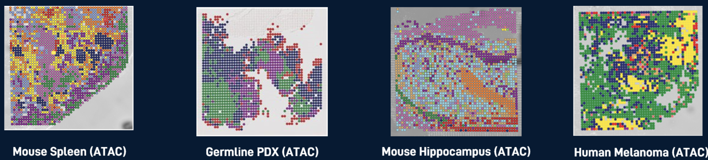

# Spatial profiling of chromatin accessibility via DBIT-seq

Deterministic Barcoding in Tissue for spatial omics sequencing (DBiT-seq) uncovers spatial biology by combining microfluidics and next- generation sequencing (NGS). Applications of the platform published in [Nature](https://www.nature.com/articles/s41586-022-05094-1), [Nature Biotech](https://www.nature.com/articles/s41587-023-01676-0), [Science](https://www.science.org/doi/10.1126/science.abg7216), and [Cell](https://www.cell.com/cell/fulltext/S0092-8674(20)31390-8?_returnURL=https%3A%2F%2Flinkinghub.elsevier.com%2Fretrieve%2Fpii%2FS0092867420313908%3Fshowall%3Dtrue), demonstrate the platform’s comprehensive, unbiased profiling of the transcriptome, proteome and, for the first time, epigenome atthe cellular level.

This repository contains the  scripts necessary to analyze data from ATAC DBIT-seq experiments performed with the barcoding scheme from [Zhang et al. 2023](https://www.nature.com/articles/s41586-023-05795-1#MOESM1) (barcodes on read2).

[AtlasXomics](https://www.atlasxomics.com) • [Docs](https://docs.atlasxomics.com) • [Discord](https://discord.com/channels/1004748539827597413/1004748540624511008)

 

