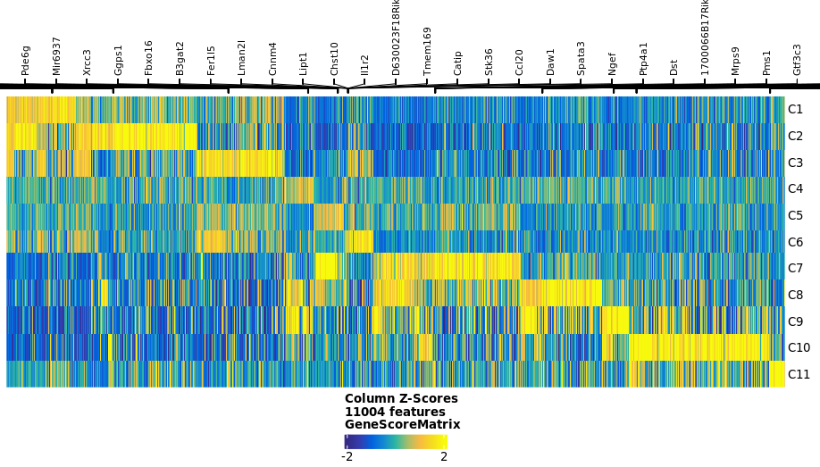
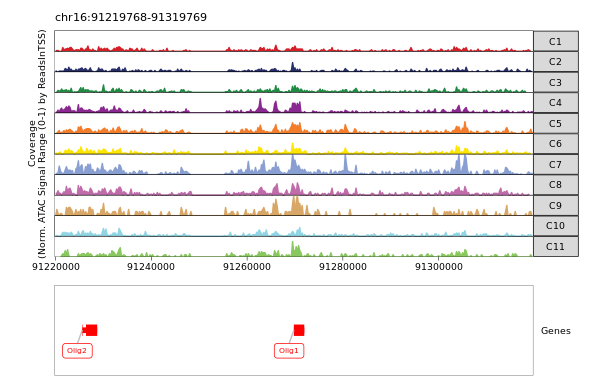
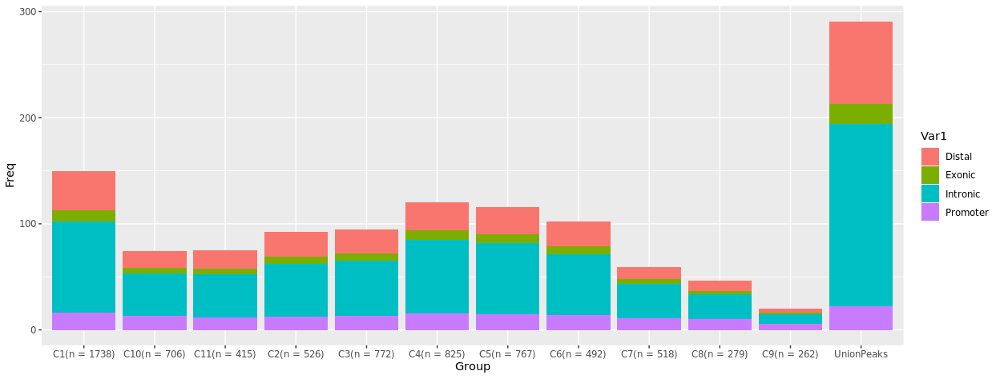
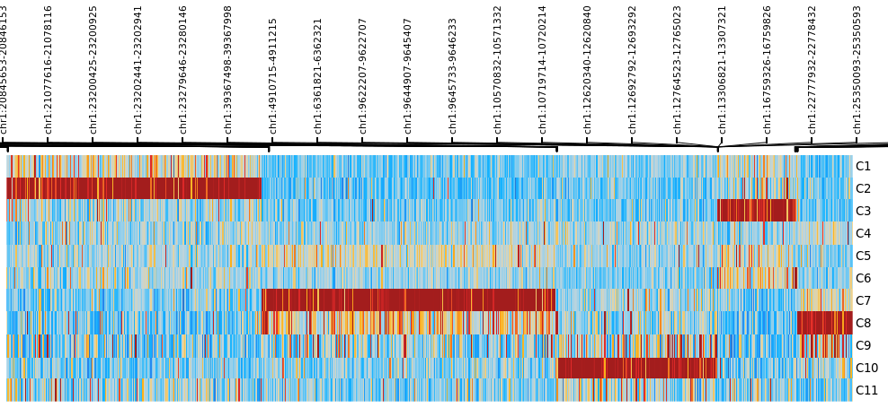
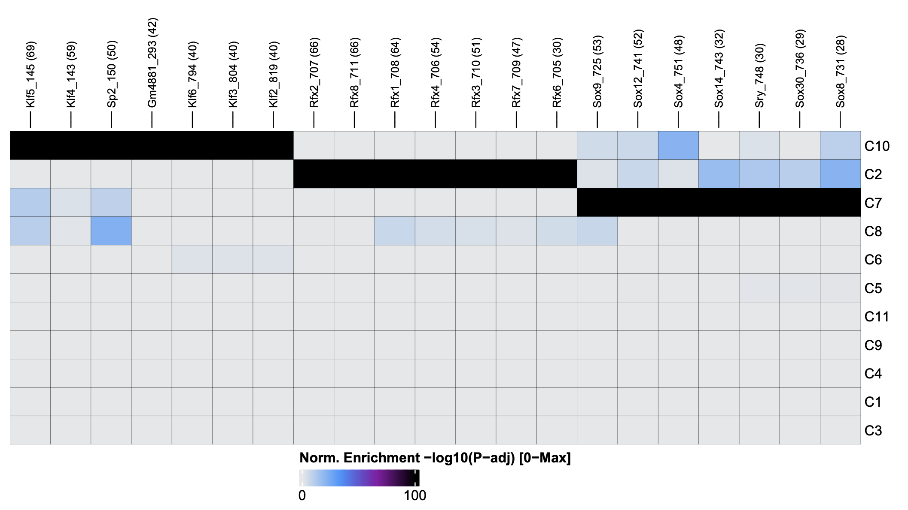
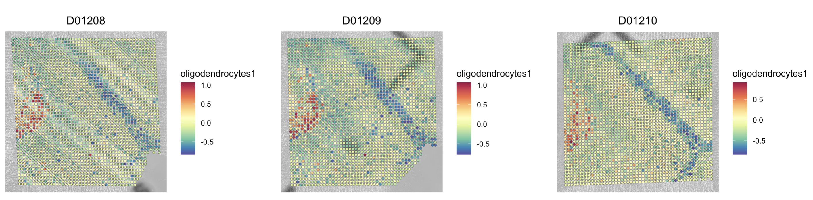

# Tutorial: Spatial-CUT&Tag via DBiT-seq

This tutorial provides a brief introduction to epigenomic analysis of
experiments performed via Deterministic Barcoding in Tissue for Spatial
Omics Sequencing (DBiT-seq). We use the
[ArchR](https://www.archrproject.com/) and
[Seurat](https://satijalab.org/seurat/) packages to create a spatially
resolved analysis object in which epigenetic information is mapped to
the tissue histology. This analysis follows standard scATAC downstream
analysis as outlined in the
[ArchR](https://www.archrproject.com/bookdown/getting-started-with-archr.html)
and [Seurat](https://satijalab.org/seurat/articles/pbmc3k_tutorial)
tutorials.

Here we present the analysis of a [spatial
CUT&Tag](https://www.science.org/doi/10.1126/science.abg7216) experiment
with triplicate mouse brain sections. The sections were profiled with an
antibody against **H3K27ac** (activating enhancers and/or promoters). We
demonstrate:

-   Creation of an ArchR analysis objects and basic QC
-   Dimensionality reduction and clustering
-   Creation of spatial Seurat objects and spatial QC
-   Differential gene regulation
-   Peak calling and motif annotation
-   Spatial analysis of genes and motifs
-   Cell typing with spatial mapping

First, we set the working directory to the local tutorial directory and
load required packages.

```{r message=FALSE}

setwd("~/atlas-git/ATX_ATAC-seq/analysis/") # change to local tutorial directory

library(ArchR)
library(dplyr)
library(ggpubr)
library(grid)
library(harmony)
library(knitr)
library(Matrix)
library(patchwork)
library(pheatmap)
library(purrr)
library(rmarkdown)
library(Seurat)

source("utils.R")

```

## Set up environment, set global variables

This tutorial assumes you have created fragments files from a epigenomic
alignment and preprocessing pipeline (ie.
[Chromap](https://www.nature.com/articles/s41467-021-26865-w), [Cell
Ranger
ATAC](https://support.10xgenomics.com/single-cell-atac/software/pipelines/latest/what-is-cell-ranger-atac)),
and 'spatial' folders via our
[AtlasXBrowser](https://docs.atlasxomics.com/projects/AtlasXbrowser/en/latest/Overview.html)
app. For our custom alignment and preprocessing workflow, see
`fastq2frags/` in this repository.

This tutorial assumes that example data (fragments, spatial folders) is
saved in in this repository in the structure described in the README.md
in this directory. To access example data, please contact your
AtlasXomics support scientist or contact
[support\@atlasxomics.com](mailto:support@atlasxomics.com){.email}.

Here, we set ArchR global variables, and three character vectors
containing sample info for analysis.

-   addArchRThreads: number of threads to use for paralelle processing;
    by defaults `threads` is set to one half of available threads. ArchR
    [recommends](https://www.archrproject.com/bookdown/getting-set-up.html)
    setting `treads` to 1/2-3/4 total available cores.

-   addArchRGenome: reference genome to be used for gene and genome
    annotations; Archr natively supports **hg19, hg38, mm9, and mm10**
    and allows for the creation of custom references. Here we use "mm10"
    (BSgenome.Mmusculus.UCSC.mm10). For more information on ArchR
    reference genomes, see ArchR
    [documentation](https://www.archrproject.com/bookdown/getting-set-up.html).

-   run_ids: identifiers for the runs/experiments included in the
    analysis; here we used standard AtlasXomics run identifiers (ie.
    Dxxxxx_NGxxxxx).

-   fragments_paths: local path to the fragments.tsv.gz files generated
    from a preprocessing and alignment pipeline; this tutorial assumes
    the file paths shown in the README.md.

-   spatial_dirs: local paths to the spatial directories generated by
    AtlasXBrowser. These directories contain images for the tissue ROI,
    run metadata, image scale factors, and a positions file (see below)
    needed to create a Seurat Object; more information on spatial Seurat
    Objects can be found
    [here](https://satijalab.org/seurat/articles/spatial_vignette_2).
    This tutorial assumes the file paths shown in the README.md.

-   position_files: local paths to the `tissue_positions_list.csv` for
    each experiment; these files contain tixel coordinates and on/off
    tissue designatins for each tixel.

```{r message=FALSE}

addArchRThreads(threads = 16)
addArchRGenome("mm10")

run_ids <- c(
  "D01208",
  "D01209",
  "D01210"
)

fragment_paths <- c(
  "./fragments/cleaned_D01208_NG02241_fragments.tsv.gz",
  "./fragments/cleaned_D01209_NG02242_fragments.tsv.gz",
  "./fragments/cleaned_D01210_NG02243_fragments.tsv.gz"
)

spatial_dirs <- c(
  "./spatials/D1208/spatial/",
  "./spatials/D1209/spatial/",
  "./spatials/D1210/spatial/"
)

position_files <- c(
  "./spatials/D1208/spatial/tissue_positions_list.csv",
  "./spatials/D1209/spatial/tissue_positions_list.csv",
  "./spatials/D1210/spatial/tissue_positions_list.csv"
)

```

## ArchRProject generation

### Generate Arrow files from fragment files

[Arrow
files](https://www.archrproject.com/bookdown/what-is-an-arrow-file-archrproject.html)
are the basic unit of analysis in ArchR. Arrow files save all sample
data on disk as HDF5 files and are updated with additional layers as
analysis progress. Arrow files are associated with a ArchRProject which
can be accessed by R and stored in memory.

For each sample, an Arrow file is generated from a [fragment
file](https://www.archrproject.com/bookdown/input-file-types-in-archr.html).
Fragment file paths and run ids are supplied to
[createArrowFiles()](https://www.archrproject.com/reference/createArrowFiles.html)
as character vectors.

Parameters `minTSS` and `minFrags` can used to remove low-quality tixels
from analysis.

By default, `createArrowFiles()` generates a
[TileMatrix](https://www.archrproject.com/reference/addTileMatrix.html)
(fragment counts per tile/bin per cell) and a
[GeneScoreMatrix](https://www.archrproject.com/bookdown/calculating-gene-scores-in-archr.html)
(computed gene activity per cell) for each sample; here we increase the
size of tiles from 500 to 5000 according to [Deng,
2022](https://www.nature.com/articles/s41586-022-05094-1).

```{r message=FALSE, warning=FALSE}

ArrowFiles <- createArrowFiles(
  inputFiles = fragment_paths,
  sampleNames = run_ids,
  minTSS = 2,
  minFrags = 0,
  maxFrags = 1e+07,
  TileMatParams = list(tileSize = 5000)
)

```

Quality control plot PDFs are saved in `./QualityControl` for each
sample during Arrow file creation.

### Create ArchRProject

ArchR accesses data by associating the Arrow files on disk with an
ArchRProject in memory.

```{r message=FALSE}

proj <- ArchRProject(
  ArrowFiles = ArrowFiles,
  outputDirectory = "ArchRProject"
)

```

### Filter "off-tissue" tixels

The tissue_positions.csv file generated via
[AtlasXBrowser](https://docs.atlasxomics.com/projects/AtlasXbrowser/en/latest/Overview.html)
is used to remove 'off-tissue' tixels from analysis.

```{r}

all_ontissue <- c()
for (i in seq_along(position_files)) {
  positions <- read.csv(position_files[i], header = FALSE)
  positions$V1 <- paste(run_ids[i], "#", positions$V1, "-1", sep = "")
  on_tissue <- positions$V1 [which(positions$V2 == 1)]
  all_ontissue <- c(all_ontissue, on_tissue)
}
proj <- proj[proj$cellNames %in% all_ontissue]

```

### QC plots

Plots of log10(unique nuclear fragments) vs TSS enrichment score and
fragment size distribution per sample can be found in the
"QualityControl" folder in working directory. Combined plots can also be
generated.

```{r}

plotTSSEnrichment(proj)
plotFragmentSizes(proj)

```


## Dimensionality reduction, clustering, UMAP plotting

Dimension reduction performed with ArchR LSI function; batch correction
performed with
[Harmony](https://www.archrproject.com/bookdown/batch-effect-correction-wtih-harmony.html).
Seurat's `FindClusters()` function is used for [graph
clustering](https://www.archrproject.com/bookdown/clustering-using-seurats-findclusters-function.html).

```{r message=FALSE}

proj <- addIterativeLSI(
  ArchRProj = proj,
  useMatrix = "TileMatrix",
  name = "IterativeLSI",
  iterations = 2,
  clusterParams = list(
    resolution = c(0.5),
    sampleCells = 10000,
    n.start = 10
  ), 
  varFeatures = 50000,
  dimsToUse = 1:30,
  force = TRUE
)

proj <- addHarmony(
  ArchRProj = proj,
  reducedDims = "IterativeLSI",
  name = "Harmony",
  groupBy = "Sample",
  force = TRUE
)

proj <- addClusters(
  input = proj,
  reducedDims = "Harmony",
  method = "Seurat",
  name = "Clusters",
  resolution = c(1.0),
  force = TRUE
)

proj <- addUMAP(
  ArchRProj = proj,
  reducedDims = "Harmony",
  name = "UMAP",
  nNeighbors = 30,
  minDist = 0.0,
  metric = "cosine",
  force = TRUE
)

```

### Plot UMAP and cluster distribution

The UMAP can be visualized and colored by sample and clusters.

```{r}

# plot the UMAP, colored by sample
p1 <- plotEmbedding(
  ArchRProj = proj,
  colorBy = "cellColData",
  name = "Sample",
  embedding = "UMAP"
)

# plot the UMAP, colored by clusters
p2 <- plotEmbedding(
  ArchRProj = proj,
  colorBy = "cellColData",
  name = "Clusters",
  embedding = "UMAP"
)

p1 + p2

```

{width="2550"}

Plot cluster distribution by sample

```{r}

df1 <- as.data.frame(proj@cellColData)
n_clusters <- length(unique(proj$Clusters))
colors <- ArchRPalettes$stallion[as.character(seq_len(n_clusters))]
names(colors) <- paste0("C", seq_len(n_clusters))

df2 <- df1 %>% group_by(Sample, Clusters) %>%
  summarise(total_count = n(), .groups = "drop") %>%
  as.data.frame()

comp1 <- ggplot(df2, aes(fill = Clusters, y = total_count, x = Sample)) +
  geom_bar(position = "stack", stat = "identity") +
  scale_fill_manual(values = colors)

comp2 <- ggplot(df2, aes(fill = Sample, y = total_count, x = Clusters)) +
  geom_bar(position = "stack", stat = "identity")

comp3 <- ggplot(df2, aes(fill = Sample, y = total_count, x = Clusters)) +
  geom_bar(position = "fill", stat = "identity")

comp1 + comp2 + comp3

```

{width="860"}

It's a good idea to frequently save your ArchRProject, especially after
running expensive computations.

```{r}

saveArchRProject(
  ArchRProj = proj,
  outputDirectory = "ArchRProject",
  load = FALSE
)

```

## SeuratObject visualization

### Build SeuratObjects

Create a metadata table for SeuratObject.

```{r}

metadata <- getCellColData(ArchRProj = proj)
rownames(metadata) <- str_split_fixed(
  str_split_fixed(
    row.names(metadata),
    "#",
    2)[, 2],
  "-",
  2)[, 1]
metadata["log10_nFrags"] <- log(metadata$nFrags)

```

Create a gene matrix for Seurat object.

```{r}

proj <- addImputeWeights(proj, reducedDims = "Harmony")

gene_matrix <- getMatrixFromProject(
  ArchRProj = proj,
  useMatrix = "GeneScoreMatrix"
)
matrix <- imputeMatrix(
  mat = assay(gene_matrix),
  imputeWeights = getImputeWeights(proj)
)
rownames(matrix) <- gene_matrix@elementMetadata$name

```

Build SeuratObjects with `build_atlas_seurat_object()` from utils.R

```{r}

seurat_objs <- c()
for (i in seq_along(run_ids)) {

  obj <- build_atlas_seurat_object(
    run_id = run_ids[i],
    matrix = matrix,
    metadata = metadata,
    spatial_path = spatial_dirs[i]
  )
  seurat_objs <- c(seurat_objs, obj)
}

```

### Spatial cluster plots

Plot the clusters identities of each tixel overlaid on top of the tissue
image with `spatial_plot()` from utils.R; this functions call the Seurat
function
[SpatialDimPlot](https://satijalab.org/seurat/reference/spatialplot).

```{r}

spatial_cluster_plots <- list()
for (i in seq_along(run_ids)){
  plot <- spatial_plot(seurat_objs[[i]], run_ids[i])
  spatial_cluster_plots[[i]] <- plot
}

ggarrange(
  plotlist = spatial_cluster_plots,
  ncol = 3,
  nrow = 1,
  common.legend = TRUE,
  legend = "bottom"
)

```


### Spatial QC plots

Plot qc metrics of each tixel overlaid on top of the tissue image with
`feature_plot()` from utils.R; this functions call the Seurat function
[SpatialFeaturePlot](https://satijalab.org/seurat/reference/spatialplot).
QC metrics to plot include:

-   TSSEnrichment
-   nFrags
-   log10_nFrags

```{r}

metric <- "log10_nFrags"

spatial_qc_plots <- list()
for (i in seq_along(run_ids)){
  plot <- feature_plot(seurat_objs[[i]], metric, run_ids[i])
  spatial_qc_plots[[i]] <- plot
}

ggarrange(plotlist = spatial_qc_plots, ncol = 3, nrow = 1, legend = "right")

```

{width="738"}

### Spatial genes plots

```{r}

gene <- "Opalin"

spatial_gene_plots <- list()
for (i in seq_along(run_ids)){
  plot <- feature_plot(seurat_objs[[i]], gene, run_ids[i])
  spatial_gene_plots[[i]] <- plot
}

ggarrange(plotlist = spatial_gene_plots, ncol = 3, nrow = 1, legend = "right")

```

{width="770"}

## Differential gene regulation

### Identify marker genes

Extract [gene
scores](https://www.archrproject.com/bookdown/gene-scores-and-marker-genes-with-archr.html)
and identify marker genes with thresholds **FDR \<= 0.05, Log2FC \>=
0.2**. `getMarkerFeatures()` returns a `SummarizedExperiment` object for
downstream analysis; `getMarkers()` converts the `SummarizedExperiment`
to a DataFrame that can be saved for later analysis.

```{r}

markersGS <- getMarkerFeatures(
  ArchRProj = proj,
  useMatrix = "GeneScoreMatrix",
  groupBy = "Clusters",
  bias = c("TSSEnrichment", "log10(nFrags)"),
  testMethod = "wilcoxon"
)

markerList <- getMarkers(markersGS, cutOff = "FDR <= 0.05 & Log2FC >= 0.2")
write.csv(markerList, file = "CnT_outs/markerList.csv", row.names = FALSE)

```

### Marker gene heatmaps

A heatmap of all marker genes by cluster can be plotted with
plotMarkerHeatmap.

```{r}

heatmapGS <- plotMarkerHeatmap(
  seMarker = markersGS,
  cutOff = "FDR <= 0.05 & Log2FC >= 0.2",
  transpose = TRUE
)

ComplexHeatmap::draw(
  heatmapGS,
  heatmap_legend_side = "bot",
  annotation_legend_side = "bot"
)

```



A subset of markers genes can be plotted as well.

```{r}

marker_genes_subset  <- c(
    "Tmem119", "Cx3cr1", "Itgam", # microglia
    "Slc1a2", "Gfap", # astrocytes
    "Mbp", "Opalin", "Mog", "Mobp", "Cspg4", "Cldn11", "Olig1", # oligodendrocytes
    "Nefh", "Syt1", "Rbfox3", # neurons
    "Slc17a7", # excitatory neuron
    "Gad1", # inhibitory neuron
    "Pdgfrb", "Ng2", # pericyte
    "Prox1" # denate gyrus
  )

subsetSE <- markersGS[which(rowData(markersGS)$name %in% marker_genes_subset), ]

heatmapGS_subset <- plotMarkerHeatmap(
  seMarker = subsetSE,
  cutOff = "FDR <= 0.05 & Log2FC >= 0.2",
  transpose = TRUE
)

heatmap(
  as.matrix(heatmapGS_subset@matrix),
  scale = "column",
  col = viridis::viridis(50)
)

```


### Genome tracks of marker genes

Local chromatin accessablity can be plotted against [genome browser
tracks](https://www.archrproject.com/bookdown/track-plotting-with-archrbrowser.html).
Here, we plot all genes in `marker_genes_subset` and save them as PDF in
the ArchRProject/Plots directory.

```{r}

tracks <- plotBrowserTrack(
  ArchRProj = proj,
  groupBy = "Clusters",
  geneSymbol = marker_genes_subset,
  upstream = 50000,
  downstream = 50000
)

# save tracks to pdf
plotPDF(
  tracks,
  ArchRProj = proj,
  length = 6,
  name = "Gene_Tracks",
  addDOC = FALSE
)

```

`grid` can be used to plot specific genes from the list.

```{r}

grid::grid.newpage()
grid::grid.draw(tracks$Olig1)

```



Save your project.

```{r}
saveArchRProject(
  ArchRProj = proj,
  outputDirectory = "ArchRProject",
  load = FALSE
)

```

## Peak Calling

[Pseudo-bulk
replicates](https://www.archrproject.com/bookdown/making-pseudo-bulk-replicates.html)
must be created for our clusters before peak calling can be performed;
they are added to the ArchRProject with the `addGroupCoverages()`
function. [Peak
calling](https://www.archrproject.com/bookdown/calling-peaks-w-macs2.html)
is performed with MACS2; specifically, we have found **MACS2 v-2.2.6**
to be compatible with ArchR. The function `findMacs2()` can be used to
find the path to your MACS2 instillation.

```{r}

proj <- addImputeWeights(proj)

proj <- addGroupCoverages(
  ArchRProj = proj,
  groupBy = "Clusters",
  force = TRUE
)

# Set to local macs2 installation
pathToMacs2 <- "/opt/mamba/envs/jupyterlab/bin/macs2"

proj <- addReproduciblePeakSet(
  ArchRProj = proj,
  groupBy = "Clusters",
  pathToMacs2 = pathToMacs2
)

```

### Plot peak distribution amoung clusters

```{r}

peak_distribution <- proj@peakSet@metadata$PeakCallSummary

comp1_peak <- ggplot(
  peak_distribution,
  aes(fill = Var1, y = Freq, x = Group)
  ) +
    geom_bar(position = "stack", stat = "identity")

comp1_peak

```



### Identify marker peaks

Extract marker peaks with thresholds FDR \<= 0.05, Log2FC \>= 0.2; save
to a csv for later analysis.

```{r}

proj <- addPeakMatrix(proj)

markersPeaks <- getMarkerFeatures(
  ArchRProj = proj,
  useMatrix = "PeakMatrix", 
  groupBy = "Clusters",
  bias = c("TSSEnrichment", "log10(nFrags)"),
  testMethod = "wilcoxon"
)

markerpeakList <- getMarkers(
  markersPeaks,
  cutOff = "FDR <= 0.05 & Log2FC >= 1"
)

write.csv(
  markerpeakList,
  file = paste0("markerpeakList.csv"),
  row.names = FALSE
)

# Collect data with annotations
peak_data = data.frame(proj@peakSet@ranges, proj@peakSet@elementMetadata)
total <- merge(peak_data, markerpeakList, by = c("start", "end"))

write.csv(
  total,
  file = paste0("complete_peak_list.csv"),
  row.names = FALSE
)

```

### Plot marker peaks

Create a heatmap of differentially regulated peaks.

```{r}

heatmap_peaks <- plotMarkerHeatmap(
  seMarker = markersPeaks,
  cutOff = "FDR <= 0.05 & Log2FC >= 1",
  transpose = TRUE
)

draw(heatmap_peaks, heatmap_legend_side = "top", show_heatmap_legend = FALSE)

plotPDF(
  heatmap_peaks,
  name = "peaks_heatmap",
  width = 10,
  length = 6,
  ArchRProj = proj,
  addDOC = FALSE
)

```



## Motif Enrichment

[Motif
annotations](https://www.archrproject.com/bookdown/motif-enrichment-in-differential-peaks.html)
can be added to an ArchRProject with `addMotifAnnotations()`.

```{r}

proj <- addMotifAnnotations(
  ArchRProj = proj,
  motifSet = "cisbp",
  name = "Motif",
  force = TRUE
)

```

### Perform motif enrichment in marker peaks

Compute per-cell deviations across all of our motif annotations using
the `addDeviationsMatrix()` function

```{r}

proj <- addDeviationsMatrix(
  ArchRProj = proj,
  peakAnnotation = "Motif",
  force = TRUE
)

plotVarDev <- getVarDeviations(
  proj,
  name = "MotifMatrix",
  plot = TRUE
)

SampleMotifs <- getMarkerFeatures(
  ArchRProj = proj,
  useMatrix = "MotifMatrix",
  groupBy = "Clusters",
  testMethod = "wilcoxon",
  bias = c("TSSEnrichment", "log10(nFrags)"),
  useSeqnames = "z"
)

enrichMotif <- peakAnnoEnrichment(
  seMarker = markersPeaks,
  ArchRProj = proj,
  peakAnnotation = "Motif",
  cutOff = "FDR <= 0.05 & Log2FC >= 0.1"
)

```

### Plot a heatmap of motifs enriched in marker peaks

```{r}

heatmapEM <- plotEnrichHeatmap(enrichMotif, n = 7, transpose = TRUE)

plotPDF(
  heatmapEM,
  name = "motifs_heatmap",
  width = 10,
  length = 6,
  ArchRProj = proj,
  addDOC = FALSE
)

heatmapEM

```



Save your ArchRProject.

```{r}

saveArchRProject(
  ArchRProj = proj,
  load = FALSE
)

```

## Approximate cell typing

<https://satijalab.org/seurat/reference/addmodulescore>

Marker genes:

-   microglia: "Tmem119", "Cx3cr1", "Itgam"
-   astrocytes: "Slc1a2", "Gfap"
-   oligodendrocytes: "Mbp", "Opalin", "Mog", "Mobp", "Cspg4", "Cldn11",
    "Olig1"
-   neurons: "Nefh", "Syt1", "Rbfox3"
-   excitatory neurons: "Slc17a7"
-   inhibitory neuron: "Gad1"
-   pericyte: "Pdgfrb"
-   denate gyrus: "Prox1"

```{r}

marker_genes <- c("Mbp", "Opalin", "Mog", "Mobp", "Cspg4", "Cldn11", "Olig1")
cell_type <- "oligodendrocytes"

geneset_plots <- list()
for (i in seq_along(run_ids)){
  plot <- geneset_plot(seurat_objs[[i]], marker_genes, cell_type, run_ids[i])
  geneset_plots[[i]] <- plot
}

ggarrange(plotlist = geneset_plots, ncol = 3, nrow = 1, legend = "right")

```


