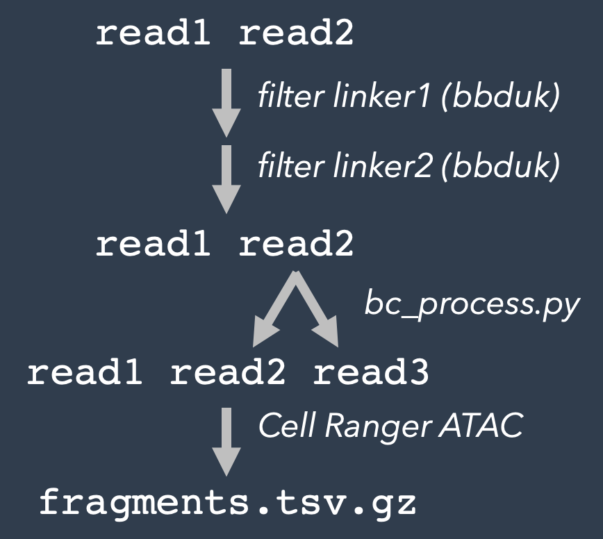
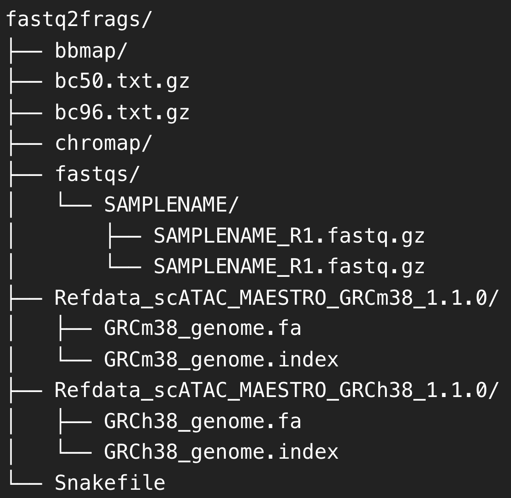
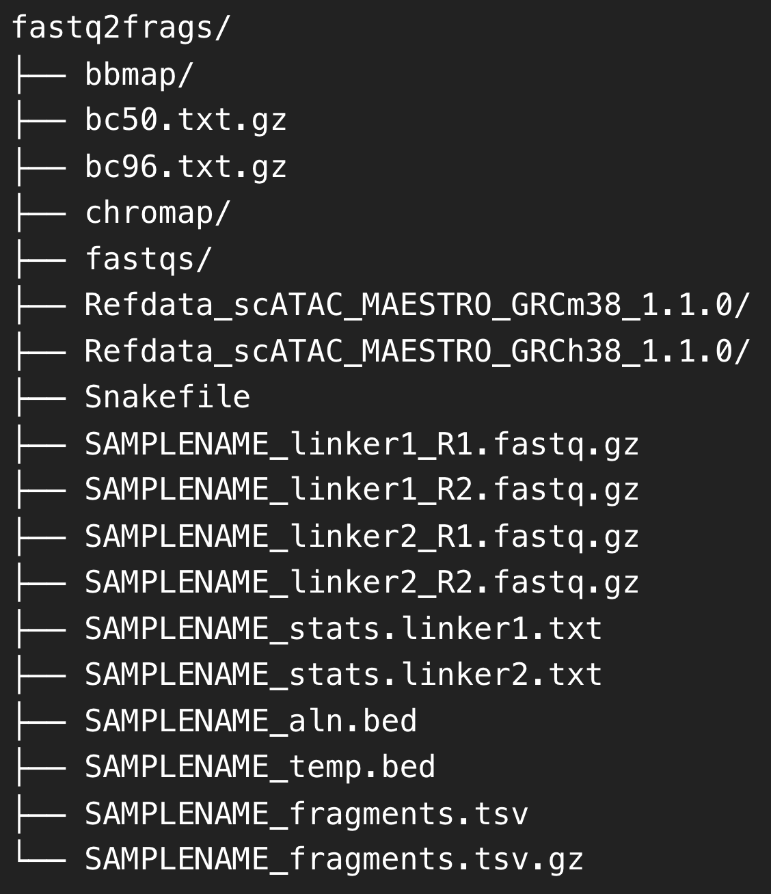

## workflow

<div>
    
</div>

The fastq2frags pipeline requires the barcoding schema described in [Zhang et al. 2023](https://www.nature.com/articles/s41586-023-05795-1#MOESM1) for Illumina short-read sequencing:
- read1: genomic sequence
- read2: linker1 | barcodeA | linker2 | barcodeB | genomic sequence

1. Filter reads on read2 ligation linker sequences with [bbduk](https://jgi.doe.gov/data-and-tools/software-tools/bbtools/).
    1. reads with >3 mismatches in the ligation linker1 are removed from analysis
    2. reads with >3 mismatches in the ligation linker2 are removed from analysis

2. Extract genomic sequence (read3) and barcode sequences (new-read2) from read 2 with split_r2.py

3. Perform sequence alignment and fragment file generation with [Cell Ranger ATAC](https://support.10xgenomics.com/single-cell-atac/software/pipelines/latest/installation).
    
## setting up the environment
The ‘fastq2frags' pipeline can be run in an AWS EC2 instance or other cloud computing resource.  Please see the [Cell Ranger ATAC](https://support.10xgenomics.com/single-cell-atac/software/overview/system-requirements) documentation for further specification.  We developed the pipeline in an EC2 instance running Linux RedHat 6.0 with 32 cores and 64GB of RAM (ami-08e637cea2f053dfa).  The pipeline requires at least 1 TB free of free disk space.  See below for instructions for setting up an environment for fastq2frags in RHL.

> For an example of running the pipeline in an HPC see [here](https://github.com/di-0579/Spatial_epigenome-transcriptome_co-sequencing/tree/main/Data_preprocessing/Spatial-ATAC-seq).

1. Install `git` and set up ssh [access](https://www.theodinproject.com/lessons/foundations-setting-up-git).

    ```
    sudo update yum 
    sudo yum install git
    ```
2. Clone the [ATC_ATAC-seq](https://github.com/atlasxomics/ATX_ATAC-seq/) repository.
    ```
    git clone git@github.com:atlasxomics/ATX_ATAC-seq.git 
    ```
3. In the fastq2frags directory, install [Cell Ranger ATAC](https://support.10xgenomics.com/single-cell-atac/software/downloads/latest); download the required reference genomes into the fastq2frags directory.
>For a _Rattus norvegicus_ and other reference genomes, please contact AtlasXomics support (support@atlasxomics.com). 
4. Install java v-7 or greater.  Java is required to run bbmap.
    ```
    sudo yum install java-11-openjdk-devel 
    ```
5. Download [bbmap](https://jgi.doe.gov/data-and-tools/software-tools/bbtools/bb-tools-user-guide/installation-guide/) into the fastq2frags repository.
    ```
    curl -L https://sourceforge.net/projects/bbmap/files/BBMap_39.01.tar.gz/download -o BBMap_39.01.tar.gz 
    tar -xvzf BBMap_39.01.tar.gz 
    ```
6. Install [mambaforge](https://snakemake.readthedocs.io/en/stable/tutorial/setup.html#step-1-installing-mambaforge).
    ```
    curl -L https://github.com/conda-forge/miniforge/releases/latest/download/Mambaforge-Linux-x86_64.sh -o Mambaforge-Linux-x86_64.sh
    bash Mambaforge-Linux-x86_64.sh
    ```
7. Install [snakemake](https://snakemake.readthedocs.io/en/stable/index.html) into a new conda enviroment.
    ```
    conda activate base
    mamba create -c conda-forge -c bioconda -n snakemake snakemake
    ```
8. Install [biopython](https://biopython.org/docs/1.75/api/index.html) into the `snakemake` environment.
    ```
    conda activate snakemake
    pip install biopython
    ```
When the environment has been correctly setup, the fastq2frags directory should have the following structure:

<div>
    
</div>

## running the pipeline
1. Upload fastq files into the fastqs directory in a subdirectory named with the sample name: ie. fastq2frags/fastq/SAMPLENAME/[SAMPLENAME_R1.fastq.gz, SAMPLENAME_R2.fastq.gz]

- AtlasXomics delivers fastq files via [latch.bio](https://latch.bio/); to facilitate transferring data from latch, you may want to install **latch cli**.
    ```
    python3 -m pip install latch
    ```
  Instructions for coping data from latch can be found [here](https://wiki.latch.bio/wiki/data/data-command-line).

2. Replace the default Cell Ranger barcode file (cellranger-atac-2.1.0/lib/python/barcodes
/737K-cratac-v1.txt) with bc50.txt.gz or bc96.txt.gz, ie.
    ```
    cp bc50.txt.gz cellranger-atac-2.1.0/lib/python/atac/barcodes/737K-cratac-v1.txt.gz 
    ```
3. Ensure the global variables in the Snakefile have the correct values; specifically, check that 'ref_dir' is assigned to the correct reference genome.
4. Activate the snakemake environment and run the workflow.
    ```
    conda activate snakemake
    snakemake -j 32
    ```
5. Once the workflow has completed, the fastq2frags directory should have the following structure.  Output files from Cell Ranger can be found in cellranger_outputs/.

<div>
    
</div>

## support
Questions? Comments?  Contact support@atlasxomics.com or post in the AtlasXomics [Discord](https://discord.com/channels/1004748539827597413/1005222888384770108).
